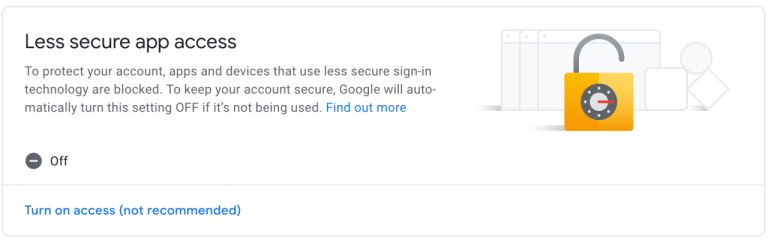

# Email Sender Module

## works with Nodemailer (free) and Sendgrid (free with limits)


### MODELO DE ENVIO PARA NODEMAILER
  ```
            //reemplace variables de entorno creando un archivo .env

            const config = {
                user: process.env.GMAIL_FOR_NODEMAILER_USER,
                pass: process.env.GMAIL_PASSWORD_FOR_NODEMAILER,
                service: 'nodemailer'
            }
            const emailSender = await crearEmailSender(config)
            const mail = {
                from: config.user, // **revisar Nota abajo
                to: 'alguien@gmail.com',
                subject: 'Send from My Module!!',
                text: 'hello Moto!',
                attachmentsPaths: ['./test/assets/ejemplo.pdf'] //campo opcional
            }
            const recibido = await emailSender.sendEmail(mail)
           console.log('enviado:' + recibido)
  ```      
#### Nota:  
El campo "from" es opcional, si no se envía, toma por defecto el de las credenciales pasadas en "config" 

#### IMPORTANTE:
           *** Para poder enviar emails debe configurar manualmente su cuenta de Gmail
           *** ingresando a su cuenta Gmail y ACTIVANDO la opción "Less Secure Apps"
           *** vaya a -> Google Account -> Security -> Less Secure Apps 



        *** podría ser necesario también habilitar permisos en display unlock captcha
        *** https://accounts.google.com/b/0/displayunlockcaptcha
        
### MODELO DE ENVIO PARA SENDGRID
```
         //reemplace variables de entorno creando un archivo .env
        //Apikey se obtiene registrándose en la página de Sendgrid/Twilio

        const config = {
            apiKey: process.env.SENDGRID_API_KEY,
            user: process.env.SENDGRID_USER_EMAIL,
            service: 'sendgrid' 
        }
        const email = {
            to: 'someone@gmail.com',
            subject: 'Hi!!',
            text: '<strong>Esto es un mensaje</strong>',
            arrayConPathDeArchivos = ['./test/assets/ejemplo.pdf'] //campo opcional
        }

        const esperado = true
        const sender = await crearEmailSender(config)
        const respuesta1 = await sender.sendEmail(email)
        assert.deepStrictEqual(respuesta1, esperado)
```
#### IMPORTANTE:
 
        *** ApiKey y el email (remitente), deben coincidir con la cuenta registrada en Sendgrid
